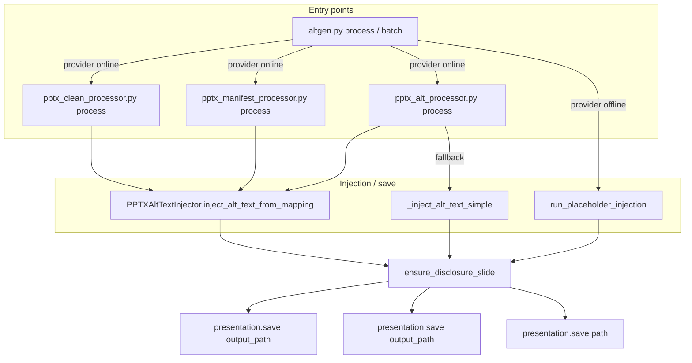

# Disclosure Slide Insertion – Plan Update (Re-check and Regression Test)

## Architecture: PPTX save paths and disclosure hook

All pipelines that write a modified PPTX flow through one of three save sites. Each must call `ensure_disclosure_slide(presentation)` immediately before saving.

**Files to touch (disclosure integration):**

| Action | File |
|--------|------|
| Create | `shared/disclosure_slide.py` |
| Edit | `core/pptx_alt_injector.py` (call before save in `inject_alt_text_from_mapping`) |
| Edit | `core/pptx_processor.py` (call before save in `_inject_alt_text_simple`) |
| Edit | `core/offline_placeholders.py` (call before save in `run_placeholder_injection`) |
| Create | `tests/test_disclosure_slide.py` |
| Edit | `AGENTS.md` (one sentence) |

---

## 1. PPTX output/save paths – complete audit

All code paths that **write a PPTX file** (and therefore must apply disclosure injection) are:

| # | File | Location | How output is produced | Disclosure hook |
|---|------|----------|------------------------|-----------------|
| 1 | **core/pptx_alt_injector.py** | `inject_alt_text_from_mapping()` ~L1591 | `presentation.save(str(output_path))` | Call `ensure_disclosure_slide(presentation)` immediately **before** this save. |
| 2 | **core/pptx_processor.py** | `_inject_alt_text_simple()` ~L6014 | `presentation.save(output_path)` (fallback path) | Call `ensure_disclosure_slide(presentation)` immediately **before** this save. |
| 3 | **core/offline_placeholders.py** | `run_placeholder_injection()` ~L208 | `presentation.save(str(path))` (offline placeholder mode) | Call `ensure_disclosure_slide(presentation)` immediately **before** this save. |

**Not additional save paths:**

- **core/pptx_processor.py** `presentation.save(str(temp_path))` (~L5933): writes a **temp** file that is then loaded by the injector and saved via (1). Final output is from (1); no extra hook.
- **pptx_alt_processor.py** / **pptx_batch_processor.py**: they call `processor.process_pptx()`, which uses either the injector (1) or fallback (2). No direct PPTX save.
- **pptx_clean_processor.py**: uses `inject_from_map()` → injector (1).
- **pptx_manifest_processor.py**: uses `inject_from_manifest()` → `_inject_using_robust_injector()` → injector (1).
- **altgen.py** batch/process: either invokes processors above or, when provider is offline, calls `run_placeholder_injection()` in **core/offline_placeholders.py** – which is path (3).

**Conclusion:** Apply disclosure in **three** places: (1) injector before save, (2) fallback in pptx_processor before save, (3) **offline_placeholders** before save. That covers all PPTX output paths.

---

## 2. Implementation details (layout selection and duplicate detection)

### Layout selection: by placeholder presence, not index

- **Do not** rely on a fixed layout index (e.g. `slide_layouts[1]`). Template and theme order varies.
- **Do** select a layout by **presence of placeholders**: choose a slide layout that has both a **title** placeholder and a **body** (content) placeholder so the disclosure title and bullets can be set without custom shapes.
- Implementation: iterate `presentation.slide_layouts` (or slide master layouts as appropriate); for each layout, inspect placeholders (e.g. via `layout.placeholders` or shape placeholder type). Pick the first layout that has both title and body placeholders. If none found, fall back to the first layout that has at least a title placeholder and document the limitation (body may be empty or require a different strategy).

### Duplicate detection: position-aware first, then all-slide text

- **Do not** rely only on `slide.shapes.title` (may be missing on some layouts or slides).
- **Do** use **all-slide text** per slide: for each slide, collect text from all shapes that have text (e.g. iterate `slide.shapes`, read `shape.text` where available), concatenate into a single string. Treat a slide as matching disclosure if that **combined text** (case-insensitive) contains "disclosure" (or "disclosures") **and** at least one of "no financial disclosures" or "federal accessibility requirements".
- **Order of checks (position-aware):**
  1. If the deck has a slide at **index 1**: check that slide first. If it matches the disclosure criteria → **return immediately** (no insertion).
  2. If index 1 does not exist or does not match, **then** scan the remaining slides (e.g. all slides, or all except index 1). If any slide matches disclosure criteria → **return immediately** (no insertion).
  3. Only if no slide matches → insert the disclosure slide at the target position (see placement rules below).
- **Expected behavior when disclosure exists elsewhere:** If a disclosure slide exists **anywhere** in the deck (e.g. at index 3 or at the end), we **do not move it** and **do not insert a second one**. "Already present anywhere" means no insertion. Document this explicitly in the helper (e.g. in docstring or module comment). No change to this behavior unless there is a compelling reason later.

### Placement rules and edge cases (empty / one-slide)

- **0 slides:** Create the disclosure as **slide 0** (index 0). After the call, the deck has exactly one slide: the disclosure slide.
- **1+ slides:** Insert the disclosure at **index 1** (second slide). Do not insert at index 0; the first slide remains the first slide.
- Implementation must branch explicitly on `len(presentation.slides) == 0` vs `>= 1` so both edge cases are correct. Tests must reflect this distinction clearly (see §4).

---

## 3. Slide insertion (reorder via `_sldIdLst`) – safety

- **Mechanism:** python-pptx only supports `slides.add_slide(layout)` (append). To place the disclosure at the required index: add the new slide at the end, then reorder by moving the last entry in the slide ID list to the **target index** (0 when deck was empty, 1 when deck had 1+ slides; see §2 placement rules).
- **Implementation pattern** (from python-pptx usage and OOXML):
  - `xml_slides = presentation.slides._sldIdLst`  # internal list of `p:sldId` elements
  - `slides_list = list(xml_slides)`  # snapshot
  - `new_slide_el = slides_list[-1]`  # the slide we just added
  - `xml_slides.remove(new_slide_el)`
  - `xml_slides.insert(target_index, new_slide_el)`
- **Safety:**
  - OOXML: `sldIdLst` is the ordered list of slide references; reordering is valid and preserves `id` / `r:id` of each slide.
  - **Caveat:** `_sldIdLst` is **internal** to python-pptx (starts with `_`). It may change in future versions; the regression test will catch breakage.
  - **Recommendation:** In `shared/disclosure_slide.py`, add a short comment that we rely on internal API for slide reorder and a regression test verifies slide order; if python-pptx adds a public `insert_slide(index, layout)` later, switch to that.

**Conclusion:** Reordering via `_sldIdLst` is the correct and safe approach for current python-pptx; document it as internal API and protect with a regression test.

---

## 4. Regression tests – slide order, placeholder selection, edge cases, offline placeholder E2E

Add a **targeted regression test** that:

1. **Empty vs one-slide vs two-slide (placement rules)**
   - **Empty deck:** Call `ensure_disclosure_slide` on a presentation with 0 slides. Assert: after call, exactly 1 slide at **index 0**; that slide is the disclosure (title "Disclosures", body contains required phrases). This enforces "0 slides → disclosure at index 0".
   - **One-slide deck:** Call on a presentation with 1 slide. Assert: after call, 2 slides; disclosure is at **index 1** (index 0 unchanged). This enforces "1+ slides → disclosure at index 1".
   - **Two-slide deck:** Build a deck with 2 slides. Call `ensure_disclosure_slide`. Assert: 3 slides; disclosure at index 1; slides at 0 and 2 unchanged. Tests reflect the distinction between empty (disclosure at 0) and non-empty (disclosure at 1) clearly.

2. **Slide order (multi-slide)**
   - Build a deck with at least 2 slides (e.g. title + one content slide). Call `ensure_disclosure_slide(presentation)`. Assert: total slide count = 3; slide at **index 1** has title "Disclosures" and body containing the required phrases; slides at index 0 and 2 unchanged.

3. **Duplicate detection: position-aware and “already present anywhere”**
   - **Index 1 already disclosure:** Deck with disclosure at index 1. Call `ensure_disclosure_slide`. Assert: slide count unchanged; no second disclosure inserted.
   - **Disclosure elsewhere:** Deck with a disclosure-matching slide at some other position (e.g. index 2 or last). Call `ensure_disclosure_slide`. Assert: no insertion (slide count unchanged); we do not move the existing disclosure and do not add a second one.

4. **Placeholder selection (non-default layout)**
   - Use a layout that is **not** the default "Title and Content" at index 1. Call `ensure_disclosure_slide(presentation)`. Assert: a slide at index 1 exists with title "Disclosures" and body containing the required phrases (layout chosen by placeholder presence).

5. **Offline placeholder save flow – end-to-end (save + reload)**
   - Build or load a minimal PPTX (e.g. one slide with an image or shape that can receive placeholder ALT). Call `run_placeholder_injection(pptx_path, ...)` so the **offline_placeholders** path runs and saves (with `ensure_disclosure_slide` applied before save). **Reload** the saved PPTX with `Presentation(saved_path)`. Assert: reloaded deck has disclosure at index 1 (title "Disclosures", body contains required phrases). Confirms disclosure round-trips through the offline_placeholder save path.

**Suggested test file:** `tests/test_disclosure_slide.py`

- **`test_disclosure_slide_empty_deck`**: 0 slides → after call, 1 slide at index 0 only; that slide is disclosure. (Enforces empty-deck edge case.)
- **`test_disclosure_slide_one_slide_deck`**: 1 slide → after call, 2 slides; disclosure at index 1, original at index 0. (Enforces one-slide edge case.)
- **`test_disclosure_slide_inserted_at_index_one`**: 2+ slides → insert → 3 slides, disclosure at index 1, order correct.
- **`test_disclosure_slide_no_duplicate_when_index_one_is_disclosure`**: disclosure already at index 1 → call → count unchanged.
- **`test_disclosure_slide_no_insert_when_disclosure_elsewhere`**: disclosure at index 2 (or elsewhere) → call → no insertion, no move; count unchanged.
- **`test_disclosure_slide_order_and_placeholder_with_alternate_layout`**: non–Title-and-Content layout; assert disclosure at index 1 with title+body (placeholder-driven layout).
- **`test_offline_placeholder_save_includes_disclosure_slide`**: `run_placeholder_injection()` → save → reload → assert disclosure at index 1 (E2E offline path).

---

## 5. Summary of plan changes

| Item | Change |
|------|--------|
| **Diagram** | Architecture diagram includes all three save paths: injector, fallback, **offline_placeholders**. |
| **Files to touch** | Explicitly list **core/offline_placeholders.py** (call before save in `run_placeholder_injection`). |
| **Layout selection** | Based on **presence of title + body placeholders**, not layout index. Iterate layouts; pick first with both placeholders. |
| **Duplicate detection** | **Position-aware first:** check slide at index 1 (if exists); if it matches disclosure criteria → return (no insert). Else scan remaining slides; if any matches → return (no insert). Use **all-slide text** per slide (all shapes’ text combined). **Document:** if disclosure exists elsewhere in the deck, we do not move it and do not insert a second one ("already present anywhere" = no insertion). |
| **Placement / edge cases** | **0 slides** → create disclosure at **index 0**. **1+ slides** → insert disclosure at **index 1**. Branch explicitly in code; tests must reflect empty vs one-slide vs two-slide clearly. |
| **_sldIdLst** | Document in code that reorder uses internal API; add regression test for slide order. |
| **Tests** | Add `tests/test_disclosure_slide.py`: **empty deck** (1 slide at index 0 = disclosure); **one-slide deck** (disclosure at index 1); insertion at index 1 for 2+ slides; **no duplicate** when index 1 is disclosure; **no insert when disclosure elsewhere**; placeholder/layout regression; **offline placeholder E2E** (save + reload, disclosure at index 1). |

All other elements (content of disclosure slide, `shared/disclosure_slide.py` helper, three save hooks, placeholder-driven layout, offline E2E) remain as previously described.
